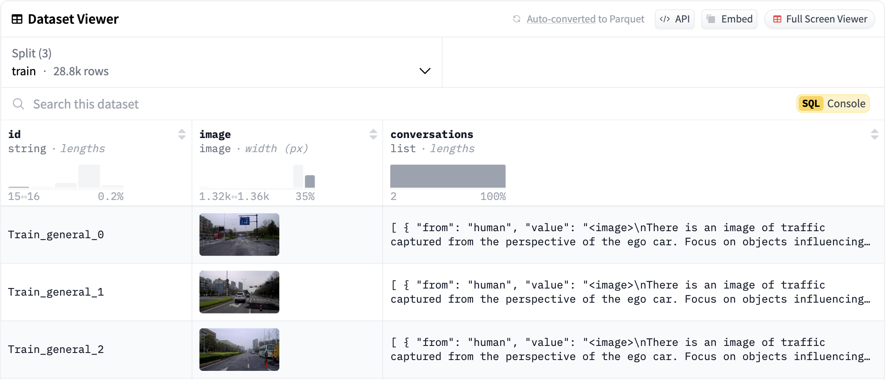
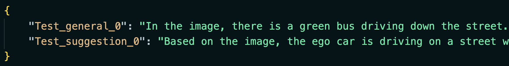

# DLCV Final Project

# How to run your code?
* TODO: Please provide the scripts for TAs to reproduce your results, including training and inference. For example, 

```
bash train.sh <Path to gt image folder> <Path to annot file>
bash inference.sh <Path to gt image folder> <Path to annot file> <Path to predicted file>
```

You can add more arguments to the script if you need.

# Usage
To start working on this final project, you should clone this repository into your local machine by the following command:
```
    git clone https://github.com/DLCV-Fall-2024/DLCV-Fall-2024-Final-1-<team_name>.git
```  
Note that you should replace `<team_name>` with your own team name.

For more details, please click [this link](https://docs.google.com/presentation/d/1eeXx_dL0OgkDn9_lhXnimTHrE6OYvAiiVOBwo2CTVOQ/edit#slide=id.g3196368f9ef_0_288) to view the slides of Final Project - .Multimodal Perception and Comprehension of Corner Cases in Autonomous Driving **The introduction video for final project can be accessed in the slides.**

After cloning the repository from GitHub, the folder structure should be like this:
```
CODA-LM/
└── few_shot/
│   ├── scene_few_shot/
│   │   ├── high.json
│   │   └── low.json
│   └── suggestion_few_shot/
│       ├── high.json
│       └── low.json 
└── gemini_eval.py
└── llama_eval.py
└── scorer.py
└── requirement.txt
...
```

# Environment Setup
1. Create a new environment (python version needs to `>=3.10`)
```
conda create -n <your_env_name> python=<python_version>=3.10>
conda activate <your_env_name>
pip install -r requirement.txt
```
2. Install Gemini API: To install Gemini API, please refer to the following command. For more details, please refer to [Gemini API](https://ai.google.dev/gemini-api/docs/quickstart?hl=zh-tw&_gl=1*ciqklc*_up*MQ..&gclid=Cj0KCQiAgJa6BhCOARIsAMiL7V8rppSkxxeqt-eVsCczUZ8Iz2mXXiTi1EkuP7K2xalpBYOk9HLgbv0aAqAIEALw_wcB&lang=python).
```
pip install -q -U google-generativeai
```
3. You can install any additional packages you need for you final project.

# Dataset



## Download Dataset
Our data is available on [huggingface](https://huggingface.co/datasets/ntudlcv/dlcv_2024_final1), you can load the data by the following command:
```
from datasets import load_dataset

dataset = load_dataset("ntudlcv/dlcv_2024_final1", split=split, streaming=True)
```
The argmument `split` can be `["train", "val", "test"]`.

## Dataset Format
for each data, the data format is as follows:
```
{
    "id": {subset_name}_{question_type}_{index},
    "image": PIL image, 
    "conversations": [
        {"from": "human", "value": "input text"}, 
        {"from": "gpt", "value": "output text"}
    ], ...
}
```
the value of key `conversations` shares the same format of LLaVA’s instruction tuning dataset format, you can see [LLaVA-instruct-150K](https://huggingface.co/datasets/liuhaotian/LLaVA-Instruct-150K) for further details


# Submission Rules
* You need to submit your predicted json file to the following link: [Codalab](https://codalab.lisn.upsaclay.fr/competitions/21009?secret_key=7bbae235-15a2-4e00-8e21-766ce95cd917&fbclid=IwZXh0bgNhZW0CMTAAAR1ZAHQiBXUiK8EN7bJm9wxxCA4DPutVfoiIOeLp6RVxpy31NSlot88bALE_aem_k_BebUC_R8P_nq9dTDlIzA)
* The submission file should be a `zip` file named in `pred.zip` containing the following files:
    * api_key.txt: your **valid** Gemini API key
    * submission.json: your predicted json file (key: `id`, value: `your model's prediction`), 
    * e.g.

* You can submit up to **5** times per day.
* For more submission details, please refer to the [slides](https://docs.google.com/presentation/d/1eeXx_dL0OgkDn9_lhXnimTHrE6OYvAiiVOBwo2CTVOQ/edit#slide=id.g319b4042369_5_87).

# Evaluation
we provide two evaluation scripts to evaluate the performance of your model in **validation set**.
1. `Gemini evaluation`: this file is identical to the one we used in Codalab
```
python3 gemini_eval.py --prediction <you predicted json file> --api_key <your gemini api key>
```
2. `Llama evaluation`: Since Gemini API has daily usage limits for free accounts, we provide a local testing option using LLaMA-3 as the LLM base model. Note that using llama_eval.py requires approximately 16GB of GPU memory.
```
python3 llama_eval.py --prediction <you predicted json file>
```
* For the argument `--prediction`, you should provide the json file which format is identical to "submission.json" described in [Submission Rules](#Submission-Rules).
* Both files will return the LLM judges and BLEU score of your predicted json file. The `Total score` is calculated by the following formula: `0.8 * LLM Score + 0.2 * BLEU-3`
```
Genral score: x.xx
Reasoning score: x.xx
Suggestion score: x.xx
LLM judges: x.xx
Bleu_1 score: x.xx
Bleu_2 score: x.xx
Bleu_3 score: x.xx
Bleu_4 score: x.xx
Total score: x.xx
```
`Notes:`
* Since the total number of validation set is over the limit of free Gemini API, we suggest testing with only a small subset of the validation set when using Gemini API evaluation.
* The results from LLaMA-3 may differ from Gemini's evaluation. Please use LLaMA-3's results **only as a reference**.
* The supplementary materials of using Gemini API and huggingface tokens can be found in [slides](https://docs.google.com/presentation/d/1eeXx_dL0OgkDn9_lhXnimTHrE6OYvAiiVOBwo2CTVOQ/edit#slide=id.g31b10de1f8f_7_155).

### Deadline
113/12/26 (Thur.) 23:59 (GMT+8)
    
# Q&A
If you have any problems related to Final Project, you may
- Use TA hours
- Contact TAs by e-mail ([ntudlcv@gmail.com](mailto:ntudlcv@gmail.com))
- Post your question under `[Final challenge 1] Discussion` section in NTU Cool Discussion

